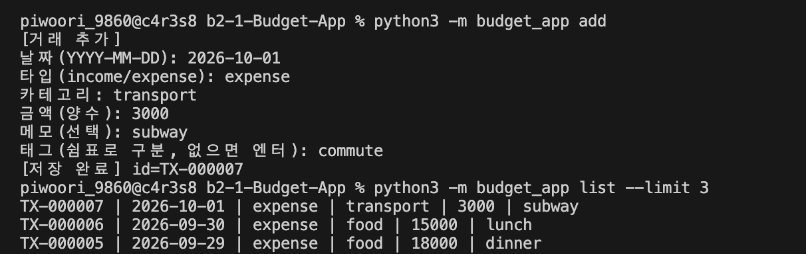
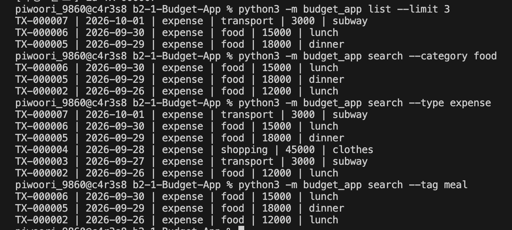
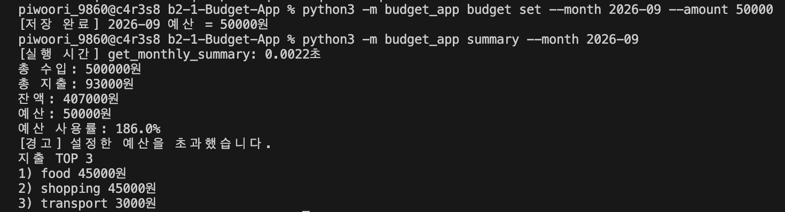
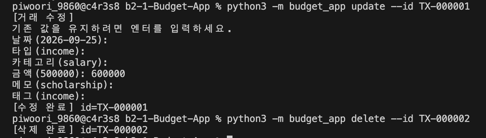
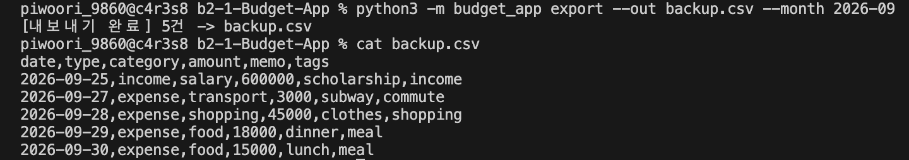
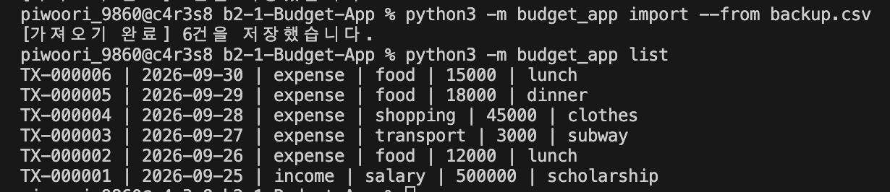
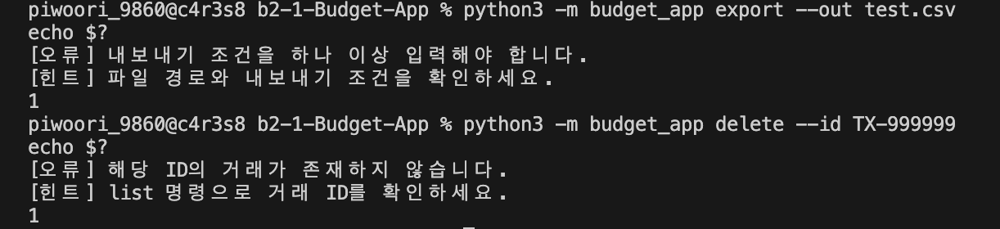

# B2-1 Budget App

Python의 파일 입출력을 활용하여 구현한 CLI 기반 용돈 기입장 프로그램입니다.

거래 내역, 카테고리, 월별 예산을 JSONL 파일에 영구 저장하며 거래 CRUD, 조건 검색, 월별 요약, 예산 관리, CSV 가져오기/내보내기 기능을 제공합니다.

## 개발 환경

- Python 3.10 이상
- Python Standard Library
- 별도의 외부 라이브러리 설치 없이 실행 가능

## 프로젝트 구조

```text
B2-1-Budget-App/
├── budget_app/
│   ├── __init__.py
│   ├── __main__.py
│   ├── cli.py
│   ├── decorators.py
│   ├── models.py
│   ├── repository.py
│   ├── service.py
│   └── validators.py
├── data/
│   ├── transactions.jsonl
│   ├── categories.jsonl
│   └── budgets.jsonl
├── docs/
│   └── images/
│       ├── 01-add-list.png
│       ├── 02-search.png
│       ├── 03-budget-summary.png
│       ├── 04-update-delete.png
│       ├── 05-export.png
│       ├── 06-import.png
│       └── 07-error-handling.png
├── .gitignore
└── README.md
```

## 실행 방법

프로젝트 루트 디렉터리에서 다음 형식으로 실행합니다.

```bash
python3 -m budget_app <command> [options]
```

전체 명령어는 다음과 같이 확인할 수 있습니다.

```bash
python3 -m budget_app --help
```

각 명령에서도 `--help` 옵션을 사용할 수 있습니다.

```bash
python3 -m budget_app search --help
python3 -m budget_app export --help
```

## 주요 기능

### 1. 거래 추가

`add` 명령은 대화형 입력 방식으로 새로운 거래를 등록합니다.

입력 항목:

- 날짜 (`YYYY-MM-DD`)
- 타입 (`income` / `expense`)
- 카테고리
- 금액
- 메모
- 태그

```bash
python3 -m budget_app add
```

거래가 저장되면 `TX-000001` 형식의 고유 ID가 생성됩니다.

### 2. 거래 목록 조회

저장된 거래를 최신순으로 조회합니다.

```bash
python3 -m budget_app list --limit 3
```

`--limit` 옵션을 통해 출력할 거래 개수를 지정할 수 있습니다.



### 3. 거래 검색

다양한 조건을 조합하여 거래를 검색할 수 있습니다.

```bash
python3 -m budget_app search --category food
python3 -m budget_app search --type expense
python3 -m budget_app search --tag meal
python3 -m budget_app search --from 2026-09-01 --to 2026-09-30
python3 -m budget_app search --q lunch
```

지원하는 검색 조건:

| 옵션 | 설명 |
| --- | --- |
| `--from` | 검색 시작 날짜 |
| `--to` | 검색 종료 날짜 |
| `--category` | 카테고리 |
| `--type` | income / expense |
| `--q` | 메모 키워드 |
| `--tag` | 태그 |

검색 결과는 최신순으로 출력됩니다.



### 4. 월별 예산 및 요약

월별 예산을 설정할 수 있습니다.

```bash
python3 -m budget_app budget set \
  --month 2026-09 \
  --amount 50000
```

월별 요약은 다음과 같이 조회합니다.

```bash
python3 -m budget_app summary --month 2026-09
```

다음 정보를 확인할 수 있습니다.

- 총 수입
- 총 지출
- 잔액
- 월 예산
- 예산 사용률
- 예산 초과 여부
- 카테고리별 지출 TOP N

`--top` 옵션으로 출력할 지출 카테고리 개수를 지정할 수도 있습니다.

```bash
python3 -m budget_app summary --month 2026-09 --top 3
```



### 5. 카테고리 관리

카테고리를 추가, 조회, 삭제할 수 있습니다.

```bash
python3 -m budget_app category add
python3 -m budget_app category list
python3 -m budget_app category remove
```

거래에서 사용 중인 카테고리는 삭제할 수 없도록 처리했습니다.

### 6. 거래 수정 및 삭제

거래 ID를 기준으로 기존 거래를 수정합니다.

```bash
python3 -m budget_app update --id TX-000001
```

수정은 대화형 방식으로 진행되며, 기존 값을 유지하려는 항목은 Enter를 입력합니다.

거래 삭제:

```bash
python3 -m budget_app delete --id TX-000002
```

존재하지 않는 ID를 입력하면 오류 원인과 해결 방법을 출력합니다.



### 7. CSV 내보내기

조건에 맞는 거래를 CSV 파일로 내보낼 수 있습니다.

월 기준:

```bash
python3 -m budget_app export \
  --out backup.csv \
  --month 2026-09
```

기간 기준:

```bash
python3 -m budget_app export \
  --out backup.csv \
  --from 2026-09-01 \
  --to 2026-09-30
```

내보내기에는 `--month`, `--from`, `--to` 중 하나 이상의 조건이 필요합니다.



### 8. CSV 가져오기

CSV 파일의 거래를 일괄 등록할 수 있습니다.

```bash
python3 -m budget_app import --from backup.csv
```

가져오기 전에 모든 데이터를 검증한 뒤 거래별 새로운 ID를 생성하여 저장합니다.



## CSV 형식

CSV 파일은 UTF-8 인코딩과 헤더를 사용합니다.

```csv
date,type,category,amount,memo,tags
2026-09-25,income,salary,500000,scholarship,income
2026-09-26,expense,food,12000,lunch,meal
```

CSV 스키마:

| 필드 | 필수 | 설명 |
| --- | --- | --- |
| `date` | Y | `YYYY-MM-DD` |
| `type` | Y | `income` 또는 `expense` |
| `category` | Y | 등록된 카테고리 |
| `amount` | Y | 0보다 큰 정수 |
| `memo` | N | 거래 메모 |
| `tags` | N | 쉼표로 구분한 태그 |

## 데이터 저장

데이터는 `data/` 디렉터리의 JSONL 파일에 영구 저장됩니다.

| 파일 | 저장 내용 |
| --- | --- |
| `data/transactions.jsonl` | 거래 내역 |
| `data/categories.jsonl` | 카테고리 |
| `data/budgets.jsonl` | 월별 예산 |

JSONL은 한 줄에 하나의 JSON 객체를 저장하는 형식입니다.

거래 데이터 예시:

```json
{"id":"TX-000001","type":"expense","date":"2026-09-30","amount":15000,"category":"food","memo":"lunch","tags":["meal"]}
```

## 프로그램 구조

프로그램의 책임을 여러 계층으로 분리했습니다.

| 모듈 | 역할 |
| --- | --- |
| `models.py` | 거래 데이터 모델 정의 |
| `repository.py` | JSONL / CSV 파일 입출력 |
| `service.py` | 거래, 검색, 요약, 예산 등의 비즈니스 로직 |
| `cli.py` | CLI 명령 및 사용자 입출력 |
| `validators.py` | 날짜, 금액, 타입 등의 입력값 검증 |
| `decorators.py` | 공통 기능을 데코레이터로 분리 |
| `__main__.py` | 프로그램 실행 및 종료 코드 처리 |

## 스트리밍 처리

거래 데이터를 처리할 때 제너레이터와 `yield`를 사용합니다.

파일 전체를 한 번에 메모리에 올리지 않고 거래를 하나씩 읽도록 구현했으며, 최신순 조회를 위한 역방향 스트리밍도 적용했습니다.

이를 통해 거래 파일의 크기가 커져도 불필요한 메모리 사용을 줄일 수 있습니다.

## 데코레이터

공통 관심사를 분리하기 위해 실행 시간 측정 데코레이터를 구현했습니다.

월별 요약 기능에 적용하여 실행 시간을 출력합니다.

```text
[실행 시간] get_monthly_summary: 0.0022초
```

## 예외 처리

잘못된 입력이나 존재하지 않는 데이터를 처리할 때 Python 스택 트레이스를 그대로 노출하지 않고 사용자에게 오류 원인과 해결 힌트를 제공합니다.

```text
[오류] 내보내기 조건을 하나 이상 입력해야 합니다.
[힌트] 파일 경로와 내보내기 조건을 확인하세요.
```

정상 실행 시 종료 코드 `0`, 오류 발생 시 `0`이 아닌 종료 코드를 반환합니다.

